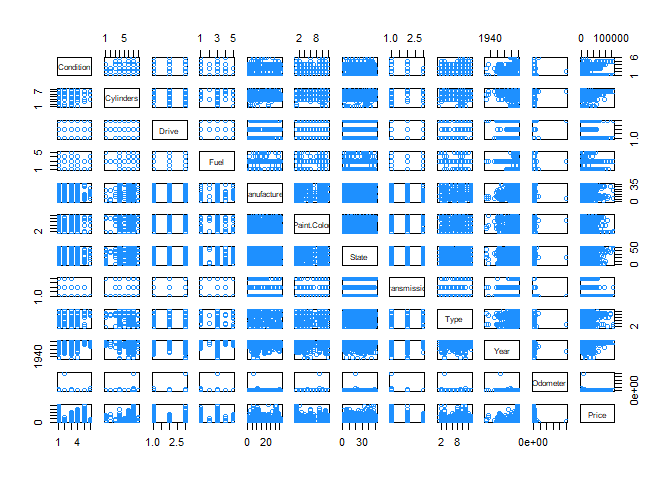
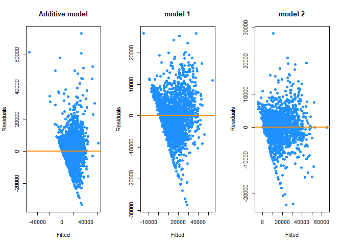
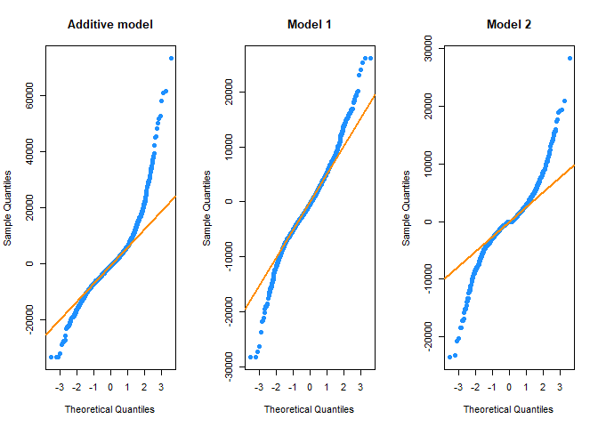
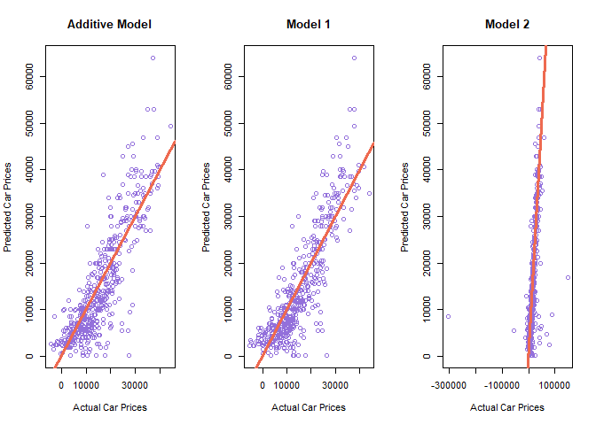

Used Car Prices in Today’s Market
================

## Introduction

Have you ever thought about car prices in today’s market? Or noticed a
trend between a car brand and it’s usual price? Or if maybe color plays
a factor? Or the mileage on it? We have! Well, we are really interested
in learning more about car sales and see if we can predict prices for
our own personal gain as a few of us on the team are going to be
purchasing a car within the next few months! We thought it would be
great to look into this data when we found it! In this study, we will be
looking at the `Used Cars Dataset` found in Kaggle.

This data set contains information about used cars for sale on
Craigslist in the United States. The data was compiled by Austin Reese
and he scraped the data from the Craigslist site using Flask and some
Python scripts (all of the code is available on his GitHub repo linked
below). It seems that he has picked this up as a side project to look
into so he updates the data set every few months, but he set up his
scraper to be used at any time if one wanted to pull the latest cars in
the market. His process to collect the data is to filter by used cars
for sale in the United States and then by city, price, manufacturer, and
odometer. A total of `26` variables were included in this data set and
we selected only `13` of these variables for our study. Our response
variable will be price, and the predictors will be condition, cylinders,
drive, fuel, manufacturer, paint color, posting date, state,
transmission, type, year, and odometer.

### Original Dataset

**Initial Data Cleaning with Tableau**

There are `426,881` entries in the original data set which is over 1 GB
in memory size and difficult to load and process in R. To deal with this
issue, our team cleaned the data with Tableau and removed the rows that
had null/empty fields which resulted in `2,585` entries out of the 426k
of the records.

**Dataset**

A total of `26` variables were included in this data set and we selected
only 13 of these variables for our study which are:

-   `Price` - price of the car (response)

-   `Condition` - condition of the car

-   `Cylinders` - number of cylinders

-   `Drive` - type of the drive

-   `Fuel` - fuel type

-   `Manufacturer` - manufacturer of the car

-   `Paint Color` - color of the car

-   `Posting Date` - date that the car was listed on Craigslist

-   `State` - state where the car was listed on Craigslist

-   `Transmission` - transmission of the car

-   `Type` - type of car (truck, car, etc.)

-   `Year` - year of entry

-   `Odometer` - miles traveled by car

We’re going to import our data set which has already been cleaned but we
will be converting our categorical variables into factor variables and
removing the posting date data.

``` r
# Load data + data cleaning
library(readr)
vehicles = read.csv("vehicles_clean.csv")
vehicles = subset(vehicles, select=-c(Posting.Date))
# Convert categorical variables into factor variables
vehicles$Condition = as.factor(vehicles$Condition)
vehicles$Cylinders = as.factor(vehicles$Cylinders)
vehicles$Drive = as.factor(vehicles$Drive)
vehicles$Fuel = as.factor(vehicles$Fuel)
vehicles$Manufacturer = as.factor(vehicles$Manufacturer)
vehicles$Paint.Color = as.factor(vehicles$Paint.Color)
vehicles$State = as.factor(vehicles$State)
vehicles$Type = as.factor(vehicles$Type)
vehicles$Transmission = as.factor(vehicles$Transmission)
```

### Objectives

We would like to study how cylinder, fuel, manufacturer, transmission,
etc. influence the price. We would also like to find out the best model
(or models) among all of these predictors and potentially compare our
top picks. Our goal is to see how close we can get at accurately
predicting the price of a used car and see if that information could be
leveraged for our own car purchases in the near future. By creating and
finding the ‘best’ model, we hope to see which predictors are the most
significant and directly impact the price (response). We will be using
methods used in class to try to find a model that meets our needs. We
are using the data found in `vehicles_clean.csv` for the values of the
predictors and response.

**Criteria**

Dealing with real-world data could be difficult. To define a “good”
model, we decided to use full additive model as our baseline model to
compare our model to as well as refer to some criteria we have used in
the class.

``` r
library(lmtest)
price_mod = lm(Price ~ ., data = vehicles)
```

``` r
# Adjusted R2
summary(price_mod)$adj.r.squared
```

    ## [1] 0.5055

``` r
# BP-test p-value
bptest(price_mod)$p.value
```

    ##        BP 
    ## 1.553e-60

``` r
# SW-test p-value
shapiro.test(resid(price_mod))$p.value
```

    ## [1] 1.273e-37

``` r
# Number of predictors
length(coef(price_mod))
```

    ## [1] 131

The full additive model consists of 131
-parameters
and an Adjusted

of 0.5055 while failing both Breusch-Pagan test and Shapiro-Wilk test,
which is not too amazing.

From here, we decided that instead of having 1 model be selected, we
would select 2 as our top picks so we could compare the results later on
in terms of comparing the LOOCV RMSE, Breusch-Pagan test results,
Shapiro-Wilk test results, adjusted
,
how well each model can predict prices once we split our data into
train/test sets, etc.

For our top 2 models we decided the following:

Model 1 (our best model) will:

-   Obtain an adjusted
    
    above `0.70`
-   Use less than `25`
    -parameters

Model 2 will:

-   Obtain an adjusted
    
    above `0.70`
-   Fail to reject the Breusch-Pagan test with an
    
    of `0.01`
-   The number of
    -parameters
    used is not relevant

## Methods

### Data preparation

Before proceeding to model-fitting, we would like to get a general idea
of our dataset first and clean up the data for further usage. To do so,
we utilized a collinearity plot to view the relationships between
different predictors and our response.

``` r
library(faraway)
pairs(vehicles, col = "dodgerblue")
```

<!-- -->

**Influential Points Diagnostics**

From the collinearity plot, it is easy to observe the existence of some
outliers. As a result, we would like to remove the influential points of
high leverage and large residual so that our fitted model will not be
affected by them.

A common measure of influence is Cook’s Distance
(),
which is often considered large if


By removing these influential points basing off the full additive model:

``` r
vehicles = vehicles[cooks.distance(price_mod) < 4 / length(cooks.distance(price_mod)), ]
```

We get the `vehicles` dataset that we will be utilizing throughout the
rest of our report.

### Model Building and Model Diagnotics

In this section, we will first define some functions for further usage
in model building and model diagnostics, including:

-   Adjusted-

-   Breusch-Pagan test

-   Shapiro-Wilk test

-   Model Size

-   LOOCV RMSE

-   RMSE

-   Fitted versus Residuals Plot

-   Q-Q Plot

``` r
# this function returns the adjusted r squared of a model
get_adj_r2 = function(model) {
  summary(model)$adj.r.squared
}

# this function returns the decision when testing the constant variance assumption
get_bp_decision = function(model, alpha = 0.01) {
  decide = unname(bptest(model)$p.value < alpha)
  ifelse(decide, "Reject", "Fail to Reject")
}

# this function returns the decision when testing the normality assumption
get_sw_decision = function(model, alpha = 0.01) {
  decide = unname(shapiro.test(resid(model))$p.value < alpha)
  ifelse(decide, "Reject", "Fail to Reject")
}

# this function returns the number of beta parameters used
get_num_params = function(model) {
  length(coef(model))
}

# this function returns the LOOCV RMSE of a model
get_loocv_rmse = function(model) {
  sqrt(mean((resid(model) / (1 - hatvalues(model))) ^ 2))
}

# this function returns the RMSE of a model
rmse = function(actual, predicted) {
  sqrt(mean((actual - predicted) ^ 2))
}

# this function plots the Fitted versus Residuals Plot
plot_fitted_resid = function(model, pointcol = "dodgerblue", linecol = "darkorange", main = "residual vs fitted") {
  plot(fitted(model), resid(model), 
       col = pointcol, pch = 20, cex = 1.5,
       main = main,
       xlab = "Fitted", ylab = "Residuals")
  abline(h = 0, col = linecol, lwd = 2)
}

# this function plots the Q-Q Plot
plot_qq = function(model, pointcol = "dodgerblue", linecol = "darkorange",  main = "Normal Q-Q Plot") {
  qqnorm(resid(model), col = pointcol, pch = 20, cex = 1.5, main = main)
  qqline(resid(model), col = linecol, lwd = 2)
}
```

### Quality Criterion

In order to obtain an initial “good” model to start from, we started off
by doing a backward search, forward search, and stepwise search for both
AIC and BIC on the additive model and tested our criteria after each
selection. We found that:

1.  The AIC models had
    Adjusted-
    values around 0.72 and used around 127
    -parameters.

2.  The BIC models had
    Adjusted-
    values around 0.70 and used around 35
    -parameters,
    which is far less than that of AIC models.

(Refer to **Appendix A** for a table of summary for different criterion
search.)

Since the difference in results was not too significant between AIC and
BIC search but BIC only needed a fraction of the number of
-parameters
compared to AIC, we decided to utilize the model from BIC search.
Because all BIC search ended up in the same model, we will use this as
our “initial good” model and proceed from here.

``` r
# Forward BIC Search
price_mod_start = lm(Price ~ 1, data = vehicles)
n = length(resid(price_mod))
price_mod_forw_bic = step(
  price_mod_start, 
  scope = Price ~ Condition + Cylinders + Drive + Fuel + Manufacturer
  + Paint.Color + State + Transmission + Type + Year + Odometer, 
  direction = "forward", k = log(n), trace = 0)
# Test criteria - forward BIC
(r_2 = get_adj_r2(price_mod_forw_bic))
(coef = length(coef(price_mod_forw_bic)))
(bptest = bptest(price_mod_forw_bic)$p.value)
shapiro.test(resid(price_mod_forw_bic))$p.value
```

From this BIC model, the results we obtained are:

1.  Adjusted-:
    0.6982
2.  Model Size: 35
3.  BP-test p-value: 3.4295^{-50}
4.  SW-test p-value: 5.8391^{-28}

### Transformations

To come up with a better model, we checked the parameters which forward
BIC search ended up in and started from an additive model of these
parameters as our base model. This includes the following predictors:
Odometer, Type, Transmission, Fuel, Cylinders, Drive, and Condition.

``` r
names(coef(price_mod_forw_bic))
```

    ##  [1] "(Intercept)"           "Odometer"              "Typeconvertible"      
    ##  [4] "Typecoupe"             "Typehatchback"         "Typemini-van"         
    ##  [7] "Typeoffroad"           "Typeother"             "Typepickup"           
    ## [10] "Typesedan"             "TypeSUV"               "Typetruck"            
    ## [13] "Typevan"               "Typewagon"             "Year"                 
    ## [16] "Transmissionmanual"    "Transmissionother"     "Fuelelectric"         
    ## [19] "Fuelgas"               "Fuelhybrid"            "Fuelother"            
    ## [22] "Cylinders12 cylinders" "Cylinders3 cylinders"  "Cylinders4 cylinders" 
    ## [25] "Cylinders5 cylinders"  "Cylinders6 cylinders"  "Cylinders8 cylinders" 
    ## [28] "Cylindersother"        "Drivefwd"              "Driverwd"             
    ## [31] "Conditionfair"         "Conditiongood"         "Conditionlike new"    
    ## [34] "Conditionnew"          "Conditionsalvage"

``` r
mod_1 = lm(Price~Odometer + Type + Transmission + Fuel + Cylinders + Drive + Condition, data = vehicles)
```

#### Polynomial Transformation

To improve the model, we started to experiment with different types of
transformation with our numerical predictors: Odometer and Year. We
started from additive model instead of interactions to limit the number
of
-parameters,
and after a tremendous number of trial and error we figured out that
polynomial in Year and Odometer greatly boosted the
adjusted-
and BP-score.

``` r
mod_2 = lm(Price ~ Odometer + I(Odometer^3) + Year + I(Year^2) + I(Year^3) + Type + Transmission + Fuel + Cylinders + Drive + Condition, data = vehicles)
get_adj_r2(mod_2)
length(coef(mod_2))
bptest(mod_2)$p.value
shapiro.test(resid(mod_2))$p.value
```

By merely adding a polynomial transformation to Odometer and Year, the
results we obtained boosted to:

1.  Adjusted-:
    0.7713
2.  Model Size: 38
3.  BP-test p-value: 1.9121^{-26}
4.  SW-test p-value: 2.7725^{-23}

We have also experimented with other types of transformations such as
log and sqrt but didn’t have any luck with them.

(Refer to **Appendix B** to see some more of our model building
efforts.)

### Predictor Elimination

To further trim down our model, we experimented with the removal of
different predictors. Some facts that we found during our trial and
error are:

-   Removing `Transmission` slightly dropped
    adjusted-
    but greatly improved BP score.
-   Removing `Condition` did not change much of the scores but trimmed
    the model
-   Removing `Type` slightly dropped
    adjusted-
    and BP score but trimmed the model down to \~60% of size

``` r
mod_3 = lm(Price ~ Odometer + I(Odometer^3) + Year + I(Year^2) + I(Year^3) + Fuel + Cylinders + Drive, data = vehicles)
get_adj_r2(mod_3)
length(coef(mod_3))
bptest(mod_3)$p.value
shapiro.test(resid(mod_3))$p.value
```

By removing `Transmission`, `Condition`, and `Type`, we trimmed down our
model to nearly half the size. Although
adjusted-
slightly dropped, we on the other hand saw improvements in BP-score and
SW-score.

1.  Adjusted-:
    0.7327
2.  Model Size: 19
3.  BP-test p-value: 8.2491^{-22}
4.  SW-test p-value: 5.707^{-19}

This model has met our criteria for Model 1, which is:

-   Obtain an adjusted
    
    above `0.70`
-   Use less than `25`
    -parameters

So we will use this model as our “best model”.

### Model Assumptions

In the class, we also discussed the assumptions of a multiple linear
regression model. The criteria we set for the other model is to meet:

-   Obtain an adjusted
    
    above `0.70`
-   Fail to reject the Breusch-Pagan test with an
    
    of `0.01`
-   The number of
    -parameters
    used is not relevant

This model will serve as a comparison to our “best” model since we were
not able to pass the BP test and SW test with the best model. We will
further compare and discuss in our Results and Discussion sections how
these 2 models perform against each other.

**Interactions and Introducing More Predictors**

To pass the BP test, we definitely will need to add interactions to our
model and introduce additional predictors. After many trial and error of
different combinations, we ended up in a model which is extremely big
but passed all criteria.

``` r
mod_4 = lm(Price ~ sqrt(Odometer) * Type * Condition + Fuel * I(Year ^ 8) * Drive + Cylinders * Manufacturer * log(Odometer) + Transmission * sqrt(Odometer) + Year * Type * Manufacturer + Condition * Transmission, data = vehicles)
get_adj_r2(mod_4)
length(coef(mod_4))
bptest(mod_4)$p.value
shapiro.test(resid(mod_4))$p.value
```

The result we got from this model is:

1.  Adjusted-:
    0.8461
2.  Model Size: 1539
3.  BP-test p-value: 0.9807
4.  SW-test p-value: 3.2079^{-34}

It has a great
adjusted-
and passed the BP test. However, the model size is way too large to be
considered “good”.

We will use this model as a comparison to our “best” model in the
following sections.

## Results

The following models are the 2 models selected by us based on the
criteria. Model 1 is our *best models* and Model 2 is a comparison to
Model 1 since it met the equal variance assumption:

``` r
model_1 = lm(Price ~ Odometer + Year + I(Year^2) + I(Year^3) + I(Odometer^3) + Cylinders + Drive + Fuel, data = vehicles)
```

``` r
model_2 = lm(Price ~ sqrt(Odometer) * Type * Condition + Fuel * I(Year ^ 8) * Drive + Cylinders * Manufacturer * log(Odometer) + Transmission * sqrt(Odometer) + Year * Type * Manufacturer + Condition * Transmission, data = vehicles)
```

Besides the 2 models listed above, we will also use the additive model
as sort of a basis to compare and see any improvements and show why we
think the model we selected at the very end is the *best* model. First,
we’re going to plot the residual vs fitted plots side-by-side to test
the constant variance assumption and linearity assumption visually. More
in depth analysis will be available in **Discussions** section.

### Residual vs Fitted plots

``` r
par(mfrow = c(1, 3))
plot_fitted_resid(price_mod, main = "Additive model")

plot_fitted_resid(model_1, main = "model 1")

plot_fitted_resid(model_2 , main = "model 2")
```

<!-- -->

We can conclude from the above three plots that `model_2` shows the best
result of the 3. Now, we’re going to test the normality assumption
visually by plotting the normal Q-Q plots side-by-side.

### Normal Q-Q plots

``` r
par(mfrow = c(1, 3))
plot_qq(price_mod, main = "Additive model")

plot_qq(model_1, main = "Model 1")

plot_qq(model_2 , main = "Model 2")
```

<!-- -->

In the case of Q-Q plots, `model_1` has a slightly better result than
the rest, but none of these plots are what we would desire so we don’t
believe the errors follow a normal distribution, but that’s ok. Let’s
keep looking at other results.

### Results Table

We are now going to compile a table with our test criteria so that we
can compare the Adjusted
,
BP Test result, number of coefficients used, etc. in each of the models.

``` r
results = data.frame(
  models = c("additive", "model_1", "model_2"),
  adj_r_2  = c(
               get_adj_r2(price_mod),
               get_adj_r2(model_1),
              get_adj_r2(model_2)),
  
   num_coef = c(
                get_num_params(price_mod), 
                get_num_params(model_1),
                get_num_params(model_2)),

  bp_test   = c(
                bptest(price_mod)$p.value, 
                bptest(model_1)$p.value,
                bptest(model_2)$p.value)
)

colnames(results) = c("Models", "Adj. R2", "Num Coef", "BP test")
knitr::kable(results, format = "markdown", digits = 52)
```

| Models   | Adj. R2 | Num Coef |   BP test |
|:---------|--------:|---------:|----------:|
| additive |  0.5055 |      131 | 0.000e+00 |
| model_1  |  0.7327 |       19 | 8.249e-22 |
| model_2  |  0.8461 |     1539 | 9.807e-01 |

Now to get into the good stuff, we did mention one of our goals being to
be able to predict car prices so we’re going to train-test split our
data and see how well our models perform.

### Average Percent Error for Predicting Car Prices

First, let’s test-train split the data.

``` r
set.seed(420)
vehicles_trn_idx  = sample(nrow(vehicles), size = trunc(0.80 * nrow(vehicles)))
vehicles_trn_data = vehicles[vehicles_trn_idx, ]
vehicles_tst_data = vehicles[-vehicles_trn_idx, ]
vehicles_trn_data = na.omit(vehicles_trn_data)
vehicles_tst_data = na.omit(vehicles_tst_data)
```

We are now going to use the training data to refit our models. Our goal
is to find a model that is useful for predicting car prices which we
will test by predicting car prices on the test data set. We will then
calculate the average percent error:


And then plot the predicted versus the actual values and add the line
.

``` r
new_price_mod = lm(Price ~ ., data = vehicles_trn_data)
new_model_1 = lm(Price ~ Odometer + Year + I(Year^2) + I(Year^3) + I(Odometer^3) + Cylinders + Drive + Fuel, data = vehicles_trn_data)
new_model_2 = lm(Price ~ sqrt(Odometer) * Type * Condition + Fuel * I(Year ^ 8) * Drive + Cylinders * Manufacturer * log(Odometer) + Transmission * sqrt(Odometer) + Year * Type * Manufacturer + Condition * Transmission, data = vehicles_trn_data)
```

``` r
price_mod_predicted_vals = predict(new_price_mod, newdata = vehicles_tst_data)

model_1_predicted_vals = predict(new_model_1, newdata = vehicles_tst_data)

model_2_predicted_vals = predict(new_model_2, newdata = vehicles_tst_data)
```

``` r
price_mod_percent_error = (mean((abs(price_mod_predicted_vals - vehicles_tst_data$Price)) / price_mod_predicted_vals)) * 100

model_1_percent_error = (mean((abs(model_1_predicted_vals - vehicles_tst_data$Price)) / model_1_predicted_vals)) * 100

model_2_percent_error = (mean((abs(model_2_predicted_vals - vehicles_tst_data$Price)) / model_2_predicted_vals)) * 100

prediction_results = data.frame(
  models = c("additive", "model_1", "model_2"),
  average_percent_error  = c(
    price_mod_percent_error,
    model_1_percent_error,
    model_2_percent_error
  ))
colnames(prediction_results) = c("Model", "Average Percent Error")
knitr::kable(prediction_results)
```

| Model    | Average Percent Error |
|:---------|----------------------:|
| additive |                 44.87 |
| model_1  |                 17.40 |
| model_2  |                 31.06 |

### Predicted vs Actual Car Prices Plots

The following plots show the predicted vs actual car prices for each of
the 3 models.

``` r
par(mfrow = c(1, 3))
plot(vehicles_tst_data$Price ~ price_mod_predicted_vals, col = "mediumpurple", 
     main = "Additive Model",
     xlab = "Actual Car Prices", ylab = "Predicted Car Prices")
abline(a = 0, b = 1, lwd = 3, col = "coral2")

plot(vehicles_tst_data$Price ~ model_1_predicted_vals, col = "mediumpurple", 
     main = "Model 1",
     xlab = "Actual Car Prices", ylab = "Predicted Car Prices")
abline(a = 0, b = 1, lwd = 3, col = "coral2")

plot(vehicles_tst_data$Price ~ model_2_predicted_vals, col = "mediumpurple", 
     main = "Model 2",
     xlab = "Actual Car Prices", ylab = "Predicted Car Prices")
abline(a = 0, b = 1, lwd = 3, col = "coral2")
```

<!-- -->

`model_1` by far has the *BEST* and lowest average percent error but
more on that later.

## Discussions

**Linearity and Constant Variance - Fitted vs Residuals**

From the Fitted vs Residuals plots, we can see that the `model_2` has
about the same number of points above and below the orange line and if
we were to take vertical slices, the midpoint of each would be right
about zero meaning equal distance and therefore the constant variance
and linearity assumption have not been violated which is great! One
point for `model_2`!

**Normality of Errors - Q-Q Plots**

The Normal Q-Q plots were interesting, all 3 plots looked about the
same - the tails of the blue line were far off from the orange line.
Ideally, the blue dots/line would follow the orange line very closely
which would mean that the normality assumption is not violated. In this
case however, `model_1` seems to follow the line the closest but still
not ideal. One point for `model_1`.

**Adjusted

and Homoscedasticity vs Model Size**

Looking at the results table, in theory `model_2` has the best Adjusted
,
and BP test result and we *could* easily conclude that `model_2` is the
best model out of the three. However, in practice we cannot use
`model_2` because it has 1539
coefficients(
values) as that is not usable and probably way too complex to sit at a
car dealership and calculate a price with this model. Like just imagine
that, you are sitting there and trying to make over 1,500 calculations
and add them and transform them, it would be quite a mess and time
consuming and one would end up being discouraged from buying a car. That
is not what we want.

**Average Percent Error**

We needed another metric and honestly more results to lead us in the
right direction for selecting one final model to predict car prices and
see how well our selected models perform. By splitting our data set into
a train set and a test set, we were able to refit our selected models on
the training set to be able to predict car prices on the testing set.
The average percent error is a metric to show how well our model is
predicting so we would prefer a lower value as this would mean that the
model is predicting very accurately. From the percent error table, we
can see that `model_1` has by far the lowest average percent error value
at 17.3982 and the `additive model (price_mod)` has the highest average
percent error value at 44.8654. So, one point for `model_1`!

**Predicted vs Actual**

Further looking into the predicted vs actual car prices plots, we can
see that in general the points do not follow the line very closely with
the exception of maybe `model_2`. However, the plot for model_2 is very
narrow and there’s some outliers floating way off the line. The additive
model and model_1 seems to have points on either side of line and they
go in the same direction but the points in model_1 are closer to the
line than those of the additive model. And considering that model_1 also
had the lowest average percent error, one more point for `model_1`!

**Final Results**

If you’ve been keeping track of the number of points(or not), here’s the
breakdown:

-   `0 points` for `price_mod` or the additive model

-   `3 points` for `model_1`

-   `1 point` for `model_2`

The results are clear and we have a winner! **model_1** is our
final/selected/best model that we could find out of the 3 and the
numerous other models that we fit. We have evidence to show that
`model_2` was probably overfitting the data and while it did have the
highest adjusted

value, that wasn’t enough to make it the best model. `model_1` is a
small model and we saw how well it did at predicting car prices! It had
the lowest average percent error and that was also depicted on the
predicted vs actual car prices plot. We believe that `model_1` is the
best that we can do given our resources and it would be a great model to
aid those in their car searches and be able to accurately car prices
given certain predictor values.

## Appendix

### Appendix A: Criteria Search Results

These are the 6 models that we used for our selection procedures. Those
being forward/backward/stepwise AIC and BIC models. Below you will also
find a table depicting the results of our test criteria on each of these
models.

``` r
price_mod = lm(Price ~ ., data = vehicles)
#Backward AIC Search
price_mod_back_aic = step(price_mod, direction = "backward", trace = 0)

#Backward BIC Search
price_mod_back_bic = step(price_mod, direction = "backward", k = log(n), trace = 0)

#Forward AIC Search
price_mod_forw_aic = step(
  price_mod_start, 
  scope = Price ~ Condition + Cylinders + Drive + Fuel + Manufacturer
  + Paint.Color + State + Transmission + Type + Year + Odometer, 
  direction = "forward", trace = 0)

#Forward BIC Search
price_mod_forw_bic = step(
  price_mod_start, 
  scope = Price ~ Condition + Cylinders + Drive + Fuel + Manufacturer
  + Paint.Color + State + Transmission + Type + Year + Odometer, 
  direction = "forward", k = log(n), trace = 0)

#Stepwise AIC Search
price_mod_both_aic = step(
  price_mod_start, 
  scope = Price ~ Condition + Cylinders + Drive + Fuel + Manufacturer
  + Paint.Color + State + Transmission + Type + Year + Odometer,
  direction = "both", trace = 0)

#Stepwise BIC Search
price_mod_both_bic = step(
  price_mod_start, 
  scope = Price ~ Condition + Cylinders + Drive + Fuel + Manufacturer
  + Paint.Color + State + Transmission + Type + Year + Odometer,
  direction = "both", k = log(n), trace = 0)
```

``` r
appendix_results = data.frame(
  models = c("Backward AIC", "Backward BIC", "Forward AIC", "Forward BIC", "Stepwise AIC", "Stepwise BIC"),
  adj_r_2  = c(
               get_adj_r2(price_mod_back_aic),
               get_adj_r2(price_mod_back_bic),
               get_adj_r2(price_mod_forw_aic),
               get_adj_r2(price_mod_back_bic),
               get_adj_r2(price_mod_both_aic),
               get_adj_r2(price_mod_both_bic)
               ),
  num_coef = c(
                get_num_params(price_mod_back_aic),
                get_num_params(price_mod_back_bic),
                get_num_params(price_mod_forw_aic),
                get_num_params(price_mod_forw_bic),
                get_num_params(price_mod_both_aic),
                get_num_params(price_mod_both_bic)
              ), 

  bp_test = c(
                bptest(price_mod_back_aic)$p.value,
                bptest(price_mod_back_bic)$p.value,
                bptest(price_mod_forw_aic)$p.value,
                bptest(price_mod_forw_bic)$p.value,
                bptest(price_mod_both_aic)$p.value,
                bptest(price_mod_both_bic)$p.value
              ),
  sw_test = c(
                shapiro.test(resid(price_mod_back_aic))$p.value,
                shapiro.test(resid(price_mod_back_bic))$p.value,
                shapiro.test(resid(price_mod_forw_aic))$p.value,
                shapiro.test(resid(price_mod_forw_bic))$p.value,
                shapiro.test(resid(price_mod_both_aic))$p.value,
                shapiro.test(resid(price_mod_both_bic))$p.value
             )
)
```

``` r
colnames(appendix_results) = c("Models", "Adj. R2", "Num Coef", "BP test", "SW test")
knitr::kable(appendix_results, format = "markdown", digits = 52)
```

| Models       | Adj. R2 | Num Coef |   BP test |   SW test |
|:-------------|--------:|---------:|----------:|----------:|
| Backward AIC |  0.7200 |      127 | 1.718e-34 | 2.800e-28 |
| Backward BIC |  0.6982 |       35 | 3.430e-50 | 5.839e-28 |
| Forward AIC  |  0.7200 |      127 | 1.718e-34 | 2.800e-28 |
| Forward BIC  |  0.6982 |       35 | 3.430e-50 | 5.839e-28 |
| Stepwise AIC |  0.7200 |      127 | 1.718e-34 | 2.800e-28 |
| Stepwise BIC |  0.6982 |       35 | 3.430e-50 | 5.839e-28 |

From the table we can see that AIC searches led to a slightly higher
adjusted

value over the BIC searches. However the BIC models tended to be
relatively smaller than the AIC models. The Shapiro-Wilk test performed
about the same for all 6 models. The Breusch-Pagan Test performed better
for the AIC models. In general, we prefer smaller models so we decided
to stick with the results from the BIC searches and continue iterating
through our model building.

### Appendix B: Model Building Efforts

When building our models for predicting car prices, we quickly saw that
we were limited by the predictors and data that we had. On our numerical
predictors, we used log, polynomial, and square root transformations.
For our categorical predictors, we could really only try interactions so
we all just went at it and tried different combinations of predictors.
Clearly the additive models weren’t performing well so we kept our goal
in mind.

We knew that we wanted:

1.  an adjusted
    
    value greater than 0.7

2.  the constant variance assumption to not be violated (fail to reject
    BP test) -OR- the normality assumption to not be violated (fail to
    reject SW test)

3.  the smaller the model, the better

You can call us greedy for wanting it all, but we learned so much as we
were building these models.

Our first challenge was to get our \#1 to be true. And we did, with this
model:

``` r
alt_mod_1 = lm(formula = Price ~ log(Odometer) * Condition * Drive + Type * Year + Cylinders + Fuel + Transmission + Manufacturer + Drive + Condition, data = vehicles)
#Test criteria 
get_adj_r2(alt_mod_1)
```

    ## [1] 0.725

``` r
get_bp_decision(alt_mod_1)
```

    ## [1] "Reject"

``` r
get_sw_decision(alt_mod_1)
```

    ## [1] "Reject"

``` r
get_num_params(alt_mod_1)
```

    ## [1] 106

But as you can see this model was essentially failing both the BP and SW
tests and it had way more than 25

parameters! We also noticed that as we added more predictors and more
interactions, the BP test p-value got higher but at the expense of the
adjusted

value. On the other hand, the SW test p-value got worse and so much
lower. Getting a reasonable SW p-value was extremely hard. We tried
everything and this is the best we could get:

``` r
alt_mod_2 = lm(Price ~  sqrt(Odometer) * Fuel + Cylinders + Condition * Fuel + log(Odometer) + Paint.Color * sqrt(Odometer) + I(Odometer ^ 3), data = vehicles)
#Test criteria
get_adj_r2(alt_mod_2)
```

    ## [1] 0.5825

``` r
shapiro.test(resid(alt_mod_2))$p.value
```

    ## [1] 6.289e-10

``` r
get_num_params(alt_mod_2)
```

    ## [1] 66

Which to be honest is quite a terrible model. It is not massive like
other ones we saw, but the p-value is not even close to even call this a
fail to reject… This was a major bummer for us to find but we realized
that we had to make a sacrifice and didn’t want to rely so much on just
the SW test so we decided to not select a model based on this test
selection. It did teach us that categorical variables make bigger models
and we can’t have all of our metrics be perfect. We had a lot of failed
attempts and we could go on and on for pages long worth of models that
we fit but we will give you one more example. This model had 1 out of 3
criteria rules met and it did have less than 200

parameters:

``` r
alt_mod_3 = lm(Price ~ I(Year ^ 9) * Fuel + Type + sqrt(Odometer) + Drive * Condition + Manufacturer + State + Paint.Color, data = vehicles)
#Test criteria
get_adj_r2(alt_mod_3)
```

    ## [1] 0.722

``` r
get_bp_decision(alt_mod_3)
```

    ## [1] "Reject"

``` r
get_sw_decision(alt_mod_3)
```

    ## [1] "Reject"

``` r
get_num_params(alt_mod_3)
```

    ## [1] 132

These 3 models might have been failed attempts but they definitely led
us in the right direction and moved us closer to finding better models
to be able to accurately predict car prices.

### References

-   Data obtained from Kaggle:
    <https://www.kaggle.com/austinreese/craigslist-carstrucks-data>

-   GitHub repo by Austin Reese’s (for scraping the data from
    Craigslist): <https://github.com/AustinReese/UsedVehicleSearch>

By: Arnab KarSarkar, Jennifer Tsai, Arely Alcantara
